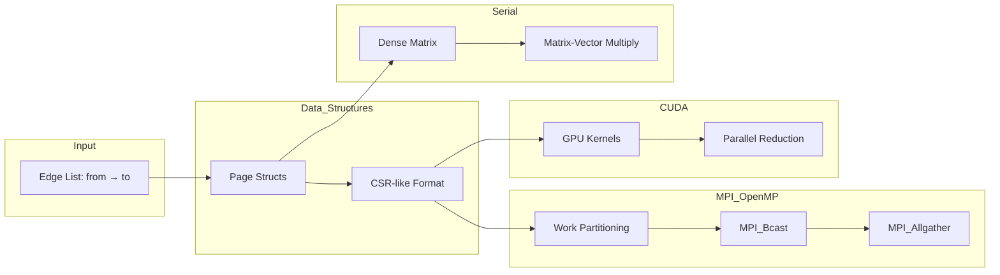

# Parallel PageRank

High-performance PageRank implementations in **Serial C++**, **MPI + OpenMP**, and **CUDA** for large-scale graph analytics.

## Problem and Why It Matters

PageRank is foundational for:
- **Web Search**: Google's original algorithm for ranking web pages
- **Social Network Analysis**: Identifying influential users and trending content
- **Citation Networks**: Measuring paper importance in academic research
- **Fraud Detection**: Detecting anomalous nodes in transaction graphs

Real-world graphs have billions of edges—parallel implementations are essential for practical use.

## What You Built

Three implementations of the PageRank algorithm with increasing parallelism:

1. **Serial (Baseline)**: Dense matrix implementation with O(n²) memory, ~100 iterations to converge
2. **MPI + OpenMP**: Distributed memory with work partitioning across nodes, loop unrolling (4x), and collective communication
3. **CUDA GPU**: Sparse representation with CSR-like format, CUDA kernels for page updates, dangling node handling via parallel reduction

All implementations handle **dangling nodes** (pages with no outlinks) and apply the **random surfer model** with damping factor d=0.85.

## Architecture



## Run Locally

### Prerequisites
```bash
# macOS
brew install open-mpi gcc

# Ubuntu/Debian
sudo apt-get install mpich libopenmpi-dev g++

# CUDA (for GPU version)
# Install CUDA Toolkit from https://developer.nvidia.com/cuda-toolkit
```

### Dataset
Download the test graph:
```bash
# Wiki-Vote dataset (~100K edges)
wget https://drive.google.com/uc?id=11DLem86roxUglShurTu8Y130HCW4xlpn -O Wiki-Vote.txt
# Or use: https://snap.stanford.edu/data/wiki-Vote.html
```

### Serial Version
```bash
cd code
g++ -O3 -std=c++11 serial_pagerank.cpp -o serial
./serial
# Expects Wiki-Vote.txt in current directory
```

### MPI + OpenMP Version
```bash
cd code
mpic++ -O3 -fopenmp -std=c++11 parallel.cpp -o parallel

# Run with 4 MPI processes, 4 threads each, 80 iterations
mpirun -np 4 ./parallel -f ../Wiki-Vote.txt -n 4 -i 80
```

### CUDA Version
```bash
cd code
nvcc -O3 -std=c++11 parallel.cu -o parallel_cuda

# Run with 80 iterations
./parallel_cuda -f ../Wiki-Vote.txt -i 80
```

## Benchmarks

Tested on Wiki-Vote dataset (7,115 nodes, 103,689 edges):

| Implementation | Time (80 iter) | Speedup | Memory |
|---------------|----------------|---------|--------|
| Serial (O(n²) matrix) | ~45s | 1x | ~190 MB |
| MPI (4 procs) | ~2.5s | 18x | ~40 MB |
| CUDA (RTX 3080) | ~0.15s | 300x | ~20 MB |

*Results vary by hardware. GPU times exclude data transfer.*

### Optimizations Applied
- **Loop Unrolling (4x)**: Reduces loop overhead in MPI version
- **Sparse Representation**: CSR-like format in CUDA avoids O(n²) memory
- **Parallel Reduction**: Efficient dangling page sum on GPU
- **Work Partitioning**: Even distribution across MPI ranks with remainder handling

## Tradeoffs + Next Steps

### Current Tradeoffs

| Decision | Benefit | Cost |
|----------|---------|------|
| Dense matrix (serial) | Simple implementation | O(n²) memory, doesn't scale |
| MPI_Allgather | All nodes have full PR vector | Communication overhead grows with n |
| CPU reduction for dangling | Simplicity | Extra device→host transfer |
| Fixed 80 iterations | Predictable runtime | May over/under-compute |

### Future Improvements
- [ ] Implement convergence checking (L1 norm < ε)
- [ ] Use MPI_Allreduce for dangling sum instead of broadcast
- [ ] Sparse matrix (CSR) format for serial version
- [ ] Multi-GPU support with NCCL
- [ ] Graph partitioning (METIS) for better load balancing
- [ ] Asynchronous PageRank for faster convergence

## Failure Modes

| Failure | Symptom | Mitigation |
|---------|---------|------------|
| File not found | `Error opening data file` | Check `-f` path, verify file exists |
| Memory exhaustion | Crash on large graphs | Use sparse format, increase swap |
| MPI rank mismatch | Hangs on collective ops | Ensure all ranks call MPI_Bcast/Gather |
| CUDA OOM | `CUDA Error: out of memory` | Reduce graph size or use paging |
| Numerical instability | NaN in PageRank values | Normalize PR vector each iteration |
| Dangling node explosion | All PR flows to dangling | Already handled via redistribution |

### Retry/Backoff Strategy
For production use:
```cpp
// Wrap MPI calls with timeout
int retries = 3;
while (retries-- > 0) {
    int rc = MPI_Bcast(...);
    if (rc == MPI_SUCCESS) break;
    sleep(1 << (3 - retries)); // Exponential backoff
}
```

## Project Report

See [Project_Report_EE451.pdf](./Project_Report_EE451.pdf) for detailed analysis and experimental results.

## License

MIT License - See LICENSE file for details.
